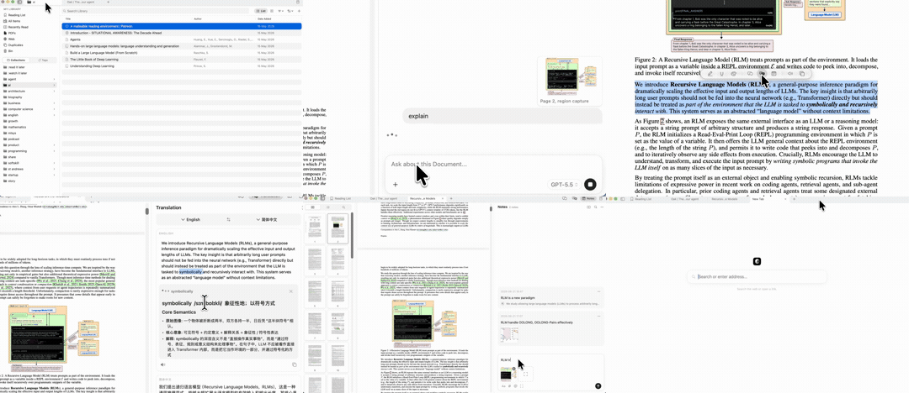
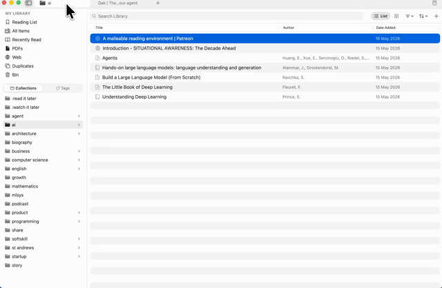
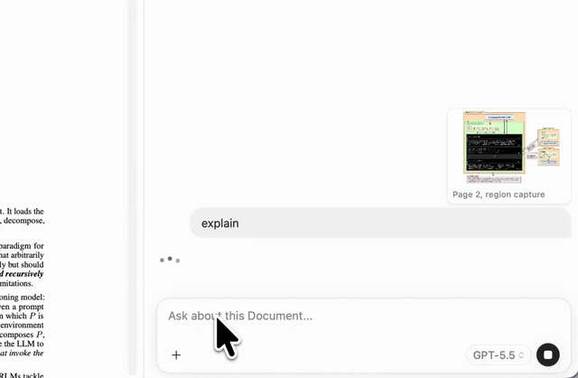
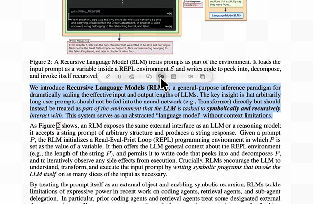
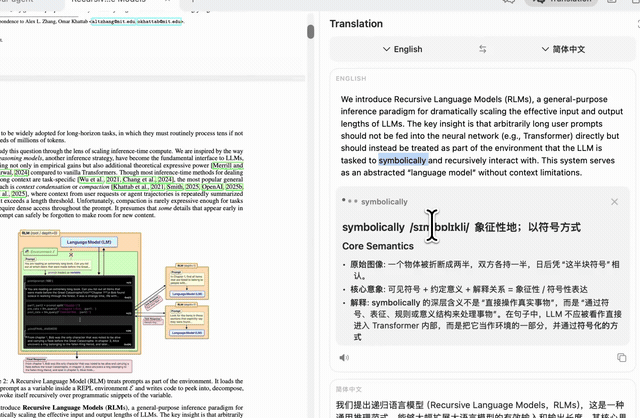
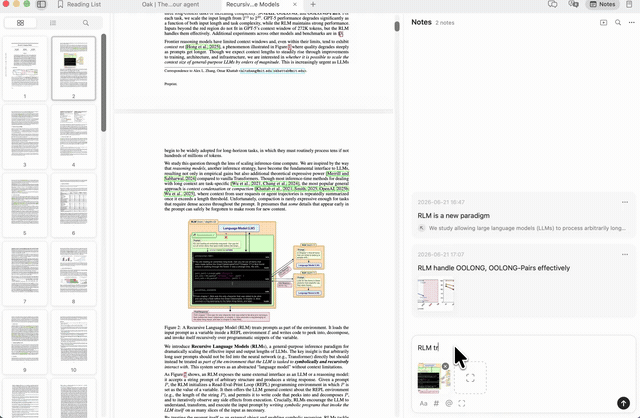
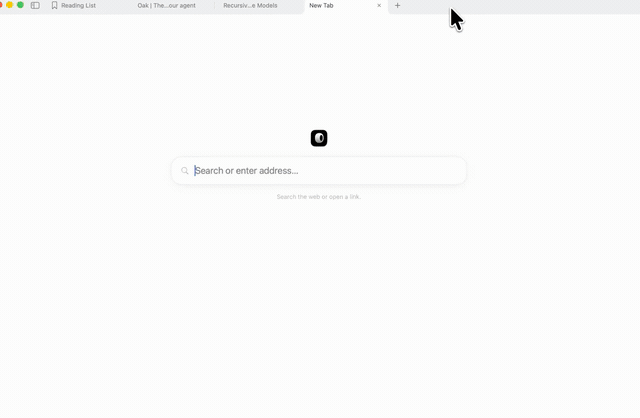

<div align="center">

# OakReader

**一个 AI 知识库，你和你的智能体共用。**

你读过的一切——PDF、论文、网页、书籍——尽归一处，
再让一位 AI 研究智能体通读全局、检索作答，
每一处引用都能点开核对。

[官网](https://oakreader.com) · [下载](https://oakreader.com) · [English](README.md)


[](LICENSE)



</div>

## OakReader 是什么

多数阅读器只是把页面显示出来。OakReader 把**你读过的一切收在一处**——再在其上架一位 AI 研究智能体，替你通读全部内容：横跨整个资料库检索、提问，给出有出处支撑的答案，每一处引用都能点开核对。而这同一个知识库，**你的 AI 智能体也能直接使用**。

它是一个原生 macOS 应用——SwiftUI + AppKit、PDFKit——以快为先，不挡你的路。

## 功能

### 📚 万卷归库，一搜即得

每一份 PDF、论文与网页，皆归入合集与标签——全文检索，连中日韩也读得懂。



### 💬 边读边问，就地作答

圈一段、附一页，直接发问——Oak 就在文档旁结合上下文作答，附上排好版的笔记、代码与公式。



### 🌐 原文译就，母语相迎

选中哪段，母语译文便紧贴原文呈现，逐句对照——不必再复制粘贴、跳去另一个翻译软件。



### 🔍 任取一词，追根究底

点一个词，便得一张详尽卡片——释义、语感、搭配与一句话要点，不留含糊。



### 📝 圈点批注，随手归档

在任意页面上标记，笔记自动收进一处面板——文字与截图剪藏，且可在你读过的一切中检索。



### 🧭 内置浏览，纵览万维

搜索、打开链接，带着登录身份读实时网页——再把要紧的收进资料库。



### 🧠 任选模型，随时切换

从前沿大厂，到跑在你 Mac 上的本地模型。每一次，由你决定。

## 技术栈

| 组成 | 框架 |
|------|------|
| 界面 | SwiftUI + AppKit |
| PDF 引擎 | PDFKit |
| 资料目录 | GRDB（SQLite） |
| AI | 多家提供商（Claude、OpenAI、Gemini，以及 Ollama / LM Studio 等本地模型）经由本地 `OakReaderAI` 包接入 |
| 检索 | 支持中日韩的全文检索 |
| 网页剪藏 | 浏览器扩展（WXT）→ 本地快照服务 |
| OCR | Apple Vision |

## 环境要求

- macOS 15.4 或更高版本
- Xcode 16 / Swift 6（从源码构建时）

## 构建

```bash
git clone https://github.com/oakreader/oakreader.git
cd oakreader
brew install xcodegen
xcodegen generate
open OakReader.xcodeproj
```

选择 **OakReader** scheme，构建并运行（<kbd>Cmd</kbd>+<kbd>R</kbd>）。
`project.yml` 是唯一真源——`.xcodeproj` 由 XcodeGen 生成。

## 下载

已签名并公证的安装包见[官网](https://oakreader.com)与 [Releases](https://github.com/oakreader/oakreader/releases) 页面。

## 参与贡献

OakReader 是开源项目，欢迎贡献——问题反馈、修复与聚焦的改进都好。较大的改动请先开一个 issue 讨论，再提 PR。

## 许可证

[MIT](LICENSE) © 2026 Jiwei Yuan
